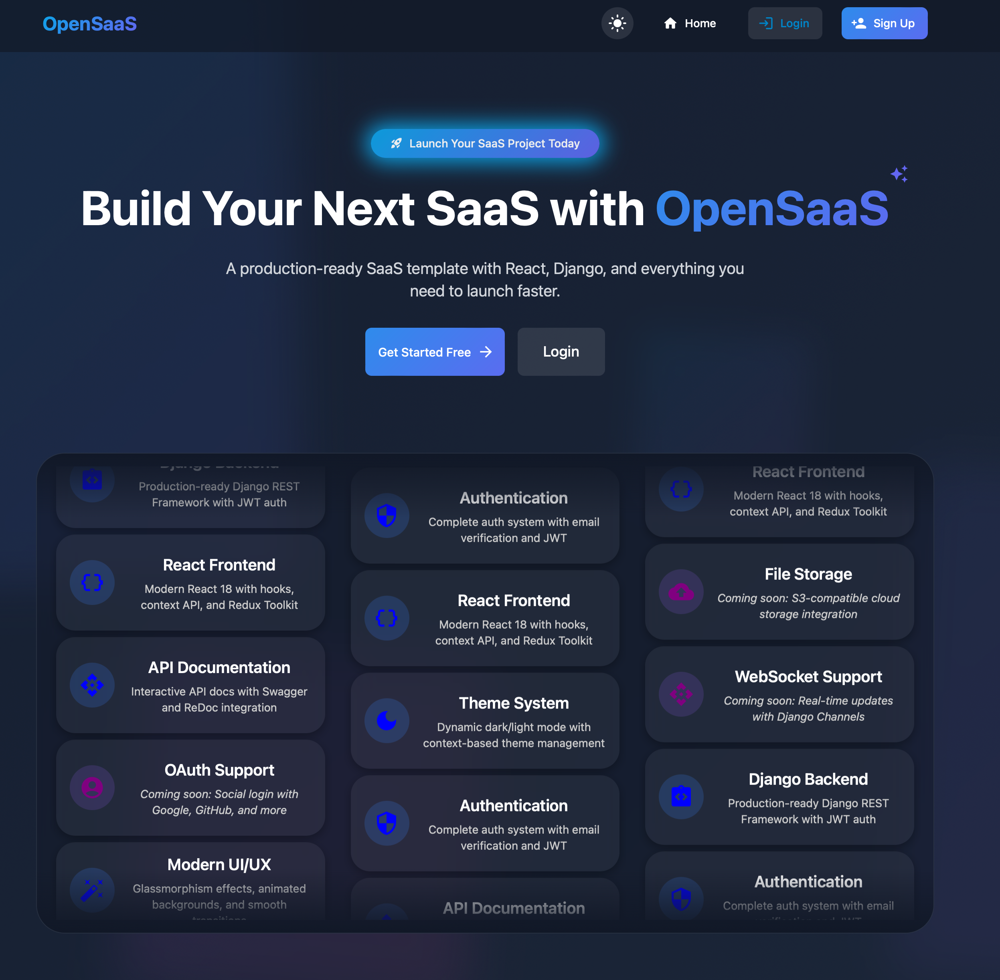
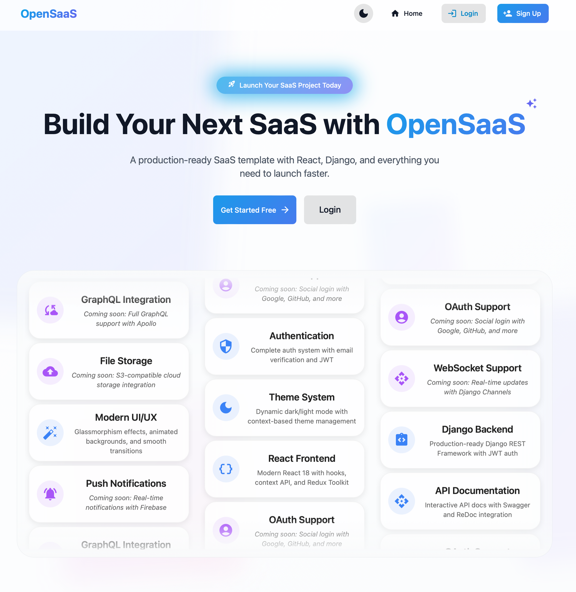

# OpenSaaS - Open Source SaaS Platform Template

OpenSaaS is an open-source platform template designed to help developers quickly launch Software-as-a-Service (SaaS) applications. Built with modern technologies and best practices, it provides essential SaaS features out of the box while maintaining flexibility for customization.


*Home page with dark theme*


*Home page with light theme*

## 📁 Project Structure

.
├── backend/                 # Django backend
│   ├── api/                # REST API endpoints
│   │   ├── management/     # Custom management commands
│   │   ├── serializers.py  # API serializers
│   │   ├── urls.py        # API routing
│   │   └── views.py       # API views
│   ├── core/              # Project configuration
│   │   ├── settings.py    # Django settings
│   │   └── urls.py       # Main URL routing
│   └── users/             # User management app
│       ├── models.py      # Custom user model
│       └── admin.py      # Admin interface
├── frontend/              # React frontend
│   ├── src/              # Source code
│   ├── public/           # Static files
│   └── Dockerfile       # Frontend container config
└── docker/              # Docker configurations

## 🎯 Features

### Authentication & User Management
- Email-based authentication with JWT verification
- Custom user model with email as primary identifier
- Mandatory email verification flow
- Session-based authentication with DRF support
- Django AllAuth integration for social authentication
- Admin interface for user management

### Backend Infrastructure
- Django 4.2 with REST Framework
- PostgreSQL database with health checks
- Swagger/OpenAPI documentation
- Environment-based configuration
- CORS configuration for frontend
- Custom management commands
- Comprehensive test suite with pytest

### Frontend Framework
- React 18 with Node.js 18 LTS
- Tailwind CSS for responsive design
- Docker-optimized build process
- Development and production configurations
- Public and protected route handling

### Development & Deployment
- Docker and Docker Compose setup
- Multi-stage build process
- Environment variable management
- Database wait functionality
- Static file handling
- Development and production configurations

## 🗺️ Roadmap

### Authentication Enhancements
- OAuth2 provider capabilities
- Social authentication providers
- Two-factor authentication
- Password reset flow
- Session management

### User Management
- User profiles and avatars
- Role-based access control (RBAC)
- Team/organization management
- User activity logging
- Account deletion flow

### API & Integration
- WebSocket support for real-time features
- API rate limiting
- Webhook system
- Third-party integration framework
- API versioning

### Development Tools
- Enhanced API documentation
- Development environment setup script
- CI/CD pipeline templates
- Code quality tools integration
- Performance monitoring

## 📋 Prerequisites

- Docker and Docker Compose
- Git
- SMTP server access for email verification

## 🛠️ Getting Started

1. Clone the repository:
   ```bash
   git clone https://github.com/yourusername/opensaas.git
   cd opensaas
   ```

2. Create a `.env` file in the root directory:
   ```
   # Django Settings
   DJANGO_SECRET_KEY=your-secret-key
   DJANGO_DEBUG=True
   DJANGO_ALLOWED_HOSTS=localhost,127.0.0.1

   # Database Settings
   DB_NAME=opensaas_db
   DB_USER=opensaas_user
   DB_PASSWORD=your_secure_password
   DB_HOST=db
   DB_PORT=5432

   # Email Settings
   EMAIL_HOST=smtp.gmail.com
   EMAIL_PORT=587
   EMAIL_USE_TLS=True
   EMAIL_HOST_USER=your-email@gmail.com
   EMAIL_HOST_PASSWORD=your-app-specific-password
   ```

3. Build and start the containers:
   ```bash
   docker-compose up --build
   ```

4. Access the application:
   - Frontend App: http://localhost:3000
   - Admin Dashboard: http://localhost:8000/admin
   - API Documentation: http://localhost:8000/api/docs

## 🏗️ Project Structure

```